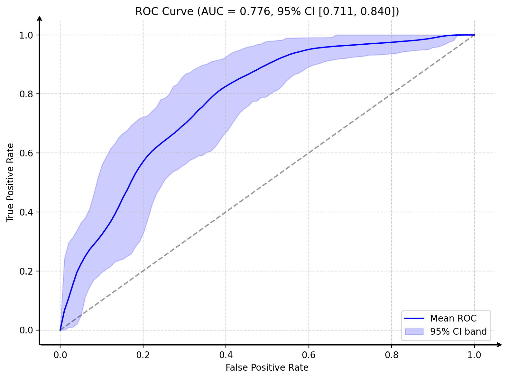

<p align="center">
  
</p>

<h3 align="center">
pAUC: A simple Python package to calculate ROC AUC confidence intervals using DeLong’s method
</h3>


<br/>

[](https://pypi.org/project/pauc/)
[](https://pypi.org/project/pauc)
[](https://github.com/srijitseal/pauc/actions/workflows/ci.yml)
[](https://pypi.org/project/pauc/)


---

## 📌 Installation

```bash
pip install pauc
```

---

## 📌 Quick Usage

```python
from pauc import roc_auc_ci_score
import numpy as np

y_true = np.array([0, 0, 1, 1, 0, 1, 0, 0, 1, 1, 0, 1])
y_pred = np.array([0.1, 0.35, 0.24, 0.8, 0.2, 0.85, 0.13, 0.85, 0.74, 0.58, 0.71, 0.25])

auc, (lb, ub) = roc_auc_ci_score(y_true, y_pred)
print(f'AUC: {auc:.3f}, 95% CI: ({lb:.3f}, {ub:.3f})')
```

```yaml
AUC: 0.708
95% CI: (0.378, 1.000)
```

---

## 📌 Comparing Two Models

```python
from pauc.roc_auc_ci import delong_roc_test
import numpy as np

y_true = np.array([0, 0, 1, 1, 0, 1, 0])
pred1 = np.array([0.1, 0.35, 0.4, 0.8, 0.2, 0.75, 0.1])
pred2 = np.array([0.5, 0.92, 0.1, 0.1, 0.8, 0.95, 0.9])

log_pval = delong_roc_test(y_true, pred1, pred2)
p_value = 10 ** log_pval
print(f"DeLong’s test p-value: {p_value}")
```

---
## 📌 Plot ROC Curve with Confidence Interval

```python
rom pauc import plot_roc_with_ci
plot_roc_with_ci(y_true, y_pred)
```
<p align="center">  </p>

This displays:

- ✅ Mean ROC curve
- 📉 Shaded 95% CI band from bootstrapping
- 📈 AUC with TPR envelope AUC range in the legend
- ℹ️ TPR envelope range is not a formal statistical CI—it's the area under the lower/upper percentile ROC curves.

---
## 📌 Why DeLong’s Test?

DeLong’s method ([DeLong et al. 1988](https://doi.org/10.2307/2531595), [Sun and Xu 2014](https://doi.org/10.1109/LSP.2014.2337313)) is:

- 📈 Statistically robust and widely used  
- ✅ Ideal for estimating AUC confidence intervals  
- 🔁 Suitable for comparing correlated ROC curves  

---

## 📌 Citation

If you use `pAUC`, please cite:

- **DeLong et al.**, *Biometrics*, 1988:  
  _Comparing the areas under two or more correlated ROC curves: a nonparametric approach_

- **Sun & Xu**, *IEEE Signal Processing Letters*, 2014:  
  _Fast Implementation of DeLong’s Algorithm for Comparing the Areas Under Correlated ROC Curves_

---

## 📌 License

Released under the **MIT License**.

---

✨ **Enjoy using `pAUC` for statistically sound AUC comparisons!**
